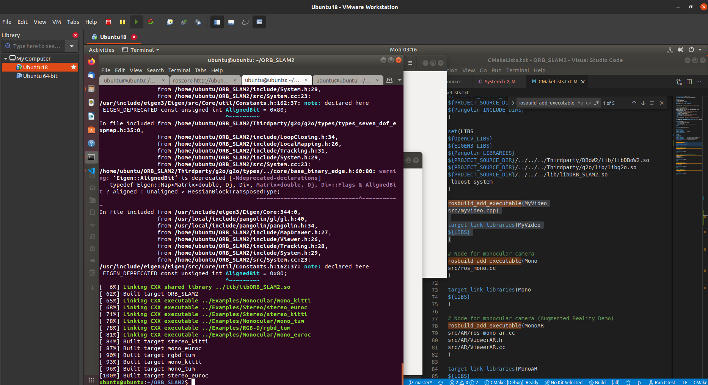
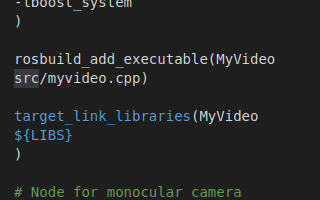
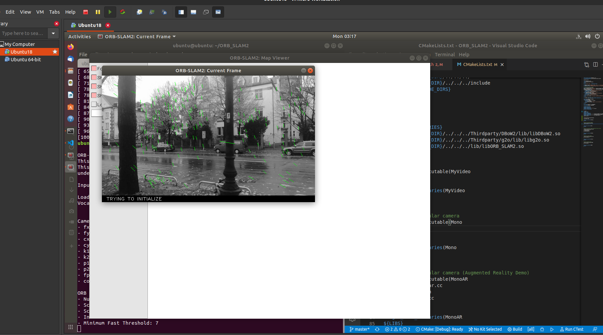

# 任务1 熟悉Linux 

1. 使用apt安装时，首先确定软件名称，之后打开terminal输入sudo apt-get install <software-name>进行安装。安装软件时，默认安装最新版的软件，且软件的依赖项也会自动查找并安装 

2. 软件源是我们在使用apt管理器安装时，下载的地址。更换软件源首先对/etc/apt/sources.list做好备份。之后比如复制ali的软件源文件代替原来的sources.list。第三方软件一般去官网，会有软件安装的流程介绍。一般流程是：手动添加软件源-软件源更新-软件安装，这个流程。 

3. 其他安装方式比如1. 下载deb软件包后双击安装2. 在图形界面的ubuntu里，打开软件商店安装3. 下载其他类型（比如sh脚本等）进行安装。 CentOS使用yum，Fedora使用dnf。 

4. PATH环境变量是系统级别的变量，包含变量名和值。比如当我们在terminal使用$HOME这个变量时，使用的是对应的主目录路径。$LD_LIBRARY_PATH是对应的非标准路径的共享库，用于在编译时候查找动态链接库的路径（非默认路径）。而ldconfig是动态链接库管理命令，目的让动态链接库可以被系统共享。 

5. Linux文件权限有w, r, x, -，分别表示写，读，执行，未被授予。修改权限用chmod。比如增加执行权限：chmod +x 

6. Linux一般是服务器默认的系统，由多个使用者同一时间访问。所以用户和用户组概念非常重要。每个使用者可以自己是一个用户，有自己的文件目录和执行权限。。有团队开发需求，则需要用户组，其由用户构成，共享文件。用户组的权限指，对自己的文件有哪些文件权限，对自己同组的人有哪些文件权限，对其他人有哪些权限。可以通过ll来显示 

7. 常见的c++编译器有gcc, clang。我电脑上默认用gcc，能够支持c++17 

 

# 任务2 SLAM文献综述 

1. Slam应用场合：AR/VR，自动驾驶中的定位，手持设备建图和定位 

2. Mapping和localization相互依赖。如果想要精确的定位，一个地图是必不可少的。如果想要构建一个地图，也需要定位辅助，来添加地图元素。 

3. Slam最早源于机器人领域。在CV领域，有类似的structure-from-motion，不过是离线处理。后来出现了实时的sfm技术，属于vslam领域。Slam由mapping和localization组成，起初它们被认为是两个方向，后来合二为一组成了slam方向。 

1986-2004 称为classical age，基于统计的模型 

2004-2015 称为algorithmic-analysis age 

4. 2011年分为两部分（不确定???）。因为是两个耦合的功能：lower-level: 机器视觉+信号处理 higher-level: 几何、图形、优化、概率等 

5. 经典文献 

* LSD-SLAM: Large-Scale Direct Monocular SLAM 

* ORB-SLAM:ORB-SLAM: a Versatile and Accurate Monocular SLAM System 

* VINS-Mono: A Robust and Versatile Monocular Visual Inertial State Estimator 

 

# 任务3 CMake练习 

见[hello](./hello)代码 

见[sayhello](./sayhello)代码 

 

# 任务 4 gflags glogg test 

1. 安装：git clone 对应的repo，mkdir build， cd build， cmake .. , make -j, sudo make install 

2. 见代码 [hello.cpp](./hello/src/hello.cpp)

3. 见代码 [useHello.cpp](./sayhello/src/useHello.cpp)

4. 见代码 [myAdd_test.cpp](./sayhello/src/myAdd_test.cpp)

 

# 任务 5 ORB_SLAM2 

1. 已完成更难作业，git clone截图省略,见任务6

2.

a. 

* 库: ORB_SLAM2; 
* 可执行文件: rgbd_tum, stereo_kitti, stereo_euroc, mono_tum, mono_kitti, mono_euroc 

b. 

Include 头文件， src包含源文件，是具体算法的实现，example包含了一些应用的示例，比如单目摄像头对kitti数据集和对应的配置文件 

c. 

只有一个库，叫ORB_SLAM2 

 

# 任务 6 ORB_SLAM2 运行 

1. 编译完成的截图

2. CMakeLists.txt 修改方案

3. 运行截图

