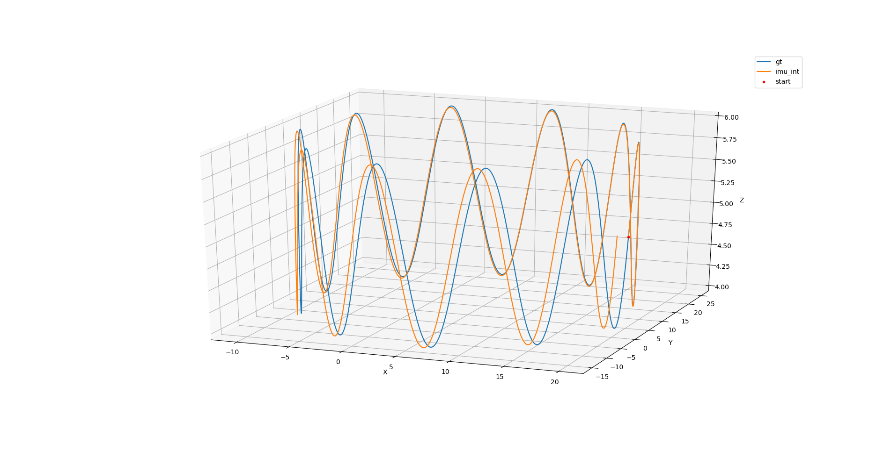
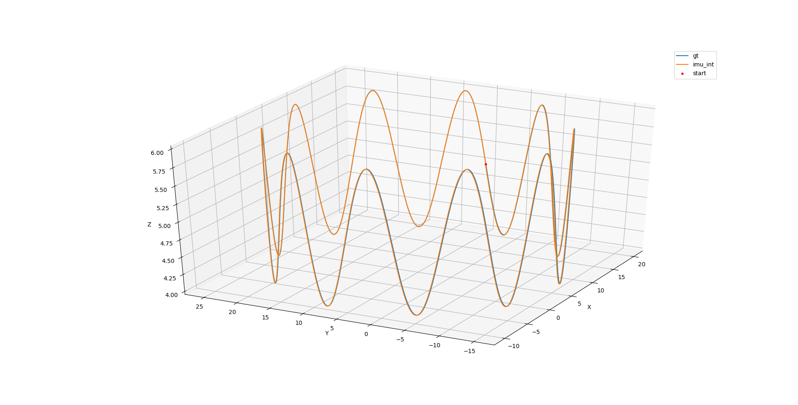

# Task 1

任务

设置imu仿真代码中不同的参数，生成allen方差曲线，并用`imu_utils`和`kalibr_utils`两个工具进行allen曲线生成。

具体曲线图片，由于图片太多，请参考对应文件夹。

### 方案一

[case1_result](./case1/)

原默认参数

| Parameters                    | Simulation | imu_utils result | kalibr_allan result |
| ----------------------------- | ---------- | ---------------- | ------------------- |
| gyro_noise_sigma              | 0.015      | 0.212            | 0.015074            |
| gyro_noise_random_walk (bias) | 0.00005    | 0.000710         | 0.000051            |
| acc_noise_sigma               | 0.019      | 0.267            | 0.019100            |
| acc_noise_random_walk (bias)  | 0.0005     | 0.00320          | 0.000481            |

### 方案二

[case2_result](./case2/)

在原默认参数基础上，将**随即游走bias**扩大为原来的100倍，进行方真

| Parameters                    | Simulation | imu_utils result | kalibr_allan result |
| ----------------------------- | ---------- | ---------------- | ------------------- |
| gyro_noise_sigma              | 0.015      | 0.219            | 0.015194            |
| gyro_noise_random_walk (bias) | **0.005**  | 0.00484          | 0.004214            |
| acc_noise_sigma               | 0.019      | 0.535            | 0.0191373           |
| acc_noise_random_walk (bias)  | **0.05**   | 0.0363           | 0.046090            |

### 方案三

[case3_result](./case3/)

在原默认参数基础上，将**随机噪声方差**扩大为原来的10倍，进行方真

| Parameters                    | Simulation | imu_utils result | kalibr_allan result |
| ----------------------------- | ---------- | ---------------- | ------------------- |
| gyro_noise_sigma              | **0.15**   | 2.110            | 0.151415            |
| gyro_noise_random_walk (bias) | 0.00005    | 0.00457          | NaN                 |
| acc_noise_sigma               | **0.19**   | 2.649            | 0.192650            |
| acc_noise_random_walk (bias)  | 0.0005     | 0.00958          | 0.00046090          |

### 结论

经过两种方法对比后发现，

* imu_utils的估计的结果比simulation设置的大10倍以上
* kalibr估计的结果与设置的相当接近
* kalibr方案三中测得一个NaN，也是因为设置数值太小的缘故。
* imu_utils在200倍播放速度下比kalibr运算快很多

imu_utils的结果相对较差我个人推测有以下几种可能

1. imu_utils的算法与kalibr_allan的算法不一样，本身效果不佳
2. 使用imu_utils时用了200倍速播放，实际上subscriber不会接受每个message，导致数据丢失，最终计算使用的数据量远远小于kalibr_allan（这也可能是kalibr运算时间很长的原因）
3. imu_utils提供了两个参数设置，分别是`max_time`和`max_cluster`，这两个参数可能影响结果

# Task2

任务：

欧拉积分改中值积分

### Result

Before



After



效果明显可见，重叠更好。

### code

注释：

```c++
//TODO

添加的中值积分代码

//TODO END

// Original Code

移除的原欧拉积分代码

// Original Code END
```

关键代码：

imu.cpp

```c++
    // TODO
    Eigen::Vector3d w_last = imudata[0].imu_gyro;
    Eigen::Vector3d a_last = imudata[0].imu_acc;
    Eigen::Quaterniond Qwb_last(Qwb);
    // TODO END
    for (int i = 1; i < imudata.size(); ++i) {

        MotionData imupose = imudata[i];

        // // * Original Code
        // //delta_q = [1 , 1/2 * thetax , 1/2 * theta_y, 1/2 * theta_z]
        // Eigen::Quaterniond dq;
        // Eigen::Vector3d dtheta_half =  imupose.imu_gyro * dt /2.0;
        // dq.w() = 1;
        // dq.x() = dtheta_half.x();
        // dq.y() = dtheta_half.y();
        // dq.z() = dtheta_half.z();
        // dq.normalize();
        
        // /// imu 动力学模型 欧拉积分推导
        // Eigen::Vector3d acc_w = Qwb * (imupose.imu_acc) + gw;  // aw = Rwb * ( acc_body - acc_bias ) + gw
        // Qwb = Qwb * dq;
        // Pwb = Pwb + Vw * dt + 0.5 * dt * dt * acc_w;
        // Vw = Vw + acc_w * dt;
        // // * Original Code End
        
        // TODO
        /// 中值积分
        Eigen::Vector3d w_m = 0.5 * (imupose.imu_gyro + w_last);
        Eigen::Vector3d a_m = 0.5 * (Qwb_last * (a_last) + gw + Qwb * (imupose.imu_acc) + gw);

        Eigen::Quaterniond dq;
        Eigen::Vector3d dtheta_half = w_m * dt / 2.0;
        dq.w() = 1;
        dq.w() = 1;
        dq.x() = dtheta_half.x();
        dq.y() = dtheta_half.y();
        dq.z() = dtheta_half.z();
        dq.normalize();

        // memorize last parameters
        w_last = imupose.imu_gyro;
        a_last = imupose.imu_acc;推导
        Qwb_last = Qwb;

        Qwb = Qwb * dq;
        Pwb = Pwb + Vw * dt + 0.5 * dt * dt * a_m;
        Vw = Vw + a_m * dt;


        // TODO END

        //　按着imu postion, imu quaternion , cam postion, cam quaternion 的格式存储，由于没有cam，所以imu存了两次
        save_points<<imupose.timestamp<<" "
                   <<Qwb.w()<<" "
                   <<Qwb.x()<<" "
                   <<Qwb.y()<<" "
                   <<Qwb.z()<<" "
                   <<Pwb(0)<<" "
                   <<Pwb(1)<<" "
                   <<Pwb(2)<<" "
                   <<Qwb.w()<<" "
                   <<Qwb.x()<<" "
                   <<Qwb.y()<<" "
                   <<Qwb.z()<<" "
                   <<Pwb(0)<<" "
                   <<Pwb(1)<<" "
                   <<Pwb(2)<<" "
                   <<std::endl;

    }

```

# Task 3

任务：阅读论文，撰写总结推导

请查看对应的[pdf](./VIO_lesson_2.pdf)

参考资料

* [Paper](http://www.bmva.org/bmvc/2013/Papers/paper0093/paper0093.pdf)
* [CSDN](https://blog.csdn.net/whut_chengjun/article/details/103114237?spm=1001.2101.3001.6650.1&utm_medium=distribute.pc_relevant.none-task-blog-2%7Edefault%7ECTRLIST%7Edefault-1.essearch_pc_relevant&depth_1-utm_source=distribute.pc_relevant.none-task-blog-2%7Edefault%7ECTRLIST%7Edefault-1.essearch_pc_relevant#commentBox)
* [CSDN](https://blog.csdn.net/weixin_45692726/article/details/102819784?spm=1001.2101.3001.6661.1&utm_medium=distribute.pc_relevant_t0.none-task-blog-2%7Edefault%7ECTRLIST%7Edefault-1.highlightwordscore&depth_1-utm_source=distribute.pc_relevant_t0.none-task-blog-2%7Edefault%7ECTRLIST%7Edefault-1.highlightwordscore)
* [CSDN](https://blog.csdn.net/qq_38373843/article/details/93165284)
* [CSDN](https://blog.csdn.net/weixin_44580210/article/details/92846020?spm=1001.2101.3001.6650.10&utm_medium=distribute.pc_relevant.none-task-blog-2%7Edefault%7EBlogCommendFromBaidu%7Edefault-10.essearch_pc_relevant&depth_1-utm_source=distribute.pc_relevant.none-task-blog-2%7Edefault%7EBlogCommendFromBaidu%7Edefault-10.essearch_pc_relevant)

