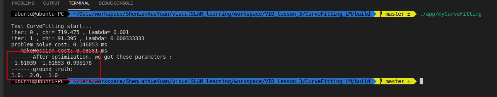

# Task 1

## Question 1

### 任务

运行代码并绘制\mu的变化曲线

### Answer

利用matplotlib进行绘制，详情代码请参考[draw_curve.py](./draw_curve.py)


## Question 2

### 任务

绘制二次曲线

### Answer



### 关键代码修改

详情请参考[my_curve_fitting.cpp](./CurveFitting_LM/app/my_curve_fitting.cpp)

修改残差计算
```c++
      // TODO
        Vec3 abc = verticies_[0]->Parameters();  // 估计的参数
        residual_(0) = abc(0)*x_*x_ + abc(1)*x_ + abc(2)  - y_;  // 构建残差
      // TODO END

```

修改雅可比计算
```c++
      // TODO
        Eigen::Matrix<double, 1, 3> jaco_abc;  // 误差为1维，状态量 3 个，所以是 1x3 的雅克比矩阵
        jaco_abc << x_ * x_ , x_ , 1;
        jacobians_[0] = jaco_abc;
      // TODO END

```

添加噪声观测部分的修改
```c++
        // TODO
        double y = a*x*x + b*x + c + n;
        // TODO END

```

## Question 3

### 任务

阅读论文，使用另一个阻尼因子的策略。

### Answer

论文提供了三种方法，其中样例代码中使用的是第三种。第二种需要对源代码改动较大，故只对第一种方法进行了应用。详情请参考文件[problem.cc](./CurveFitting_LM/backend/problem.cc)

关键代码，重写了 `Problem::IsGoodStepInLM()` 部分，将原先代码注释掉

```c++
// TODO new update method 1
bool Problem::IsGoodStepInLM() {
    Vec3 diagonal = Hessian_.diagonal();
    Mat33 Hessian_diagonal;
    Hessian_diagonal << diagonal(0), 0, 0,
                        0, diagonal(1), 0,
                        0, 0, diagonal(2);

    double scale = 0;
    // scale = delta_x_.transpose() * (currentLambda_ * maxDiagonal * delta_x_ + b_);
    scale = delta_x_.transpose() * (currentLambda_ * Hessian_diagonal * delta_x_ + b_);
    scale += 1e-3;    // make sure it's non-zero :)

    // recompute residuals after update state
    // 统计所有的残差
    double tempChi = 0.0;
    for (auto edge: edges_) {
        edge.second->ComputeResidual();
        tempChi += edge.second->Chi2();
    }

    double rho = (currentChi_ - tempChi) / scale;
    if (rho > 0 && isfinite(tempChi))   // last step was good, 误差在下降
    {
        currentLambda_ = (std::max)(currentLambda_/9., 10e-7);
        currentChi_ = tempChi;
        return true;
    } else {
        currentLambda_ = (std::min)(currentLambda_*11., 10e+7);
        return false;
    }
}
// TODO END

```

### 结果


### 对比

与原方法对比，原方法需要11个iterations，新的方法需要9个iterations，且精度一样。性能略有提升。

# Task 2 & Task 3

请参考[pdf](./docs/VIO_lesson_3.pdf)推导

# 作业更正

## Task 1

之前未对method1的init部分修正。现在进行了修改。在`problem.cc`上方19行有一处代码，来控制method。（之前是通过注释来切换method）

```c++
static int method = 3;
```

我并没有应用method2，我有一个问题在这里：

提供的框架在check is good step这个函数前，已经进行了update。如果不是goodStep则Rollback。对于论文中的方法2，需要先使用Chi2(p+h)来计算alpha，在用rho(alpha * h)来判断是否good。

我思考了下，论文是先判断good再update，而代码中是先update，不好再rollback。所以方法2并不是很好实施。如果硬要实施需要反复update 或者rollback。

所以我没有应用这个方法

## Task 2

针对推导的错误，已经按照ppt课件和批注进行修改。谢谢批改！

我在这里也有个问题，关于delta_t是怎么从反对称矩阵里面移动到外面，我的理解是delta_t是标量，所以可以任意移动。所以我不明白为什么f15式(3)第5行到第6行叉乘的变换（deta t^2）的问题。