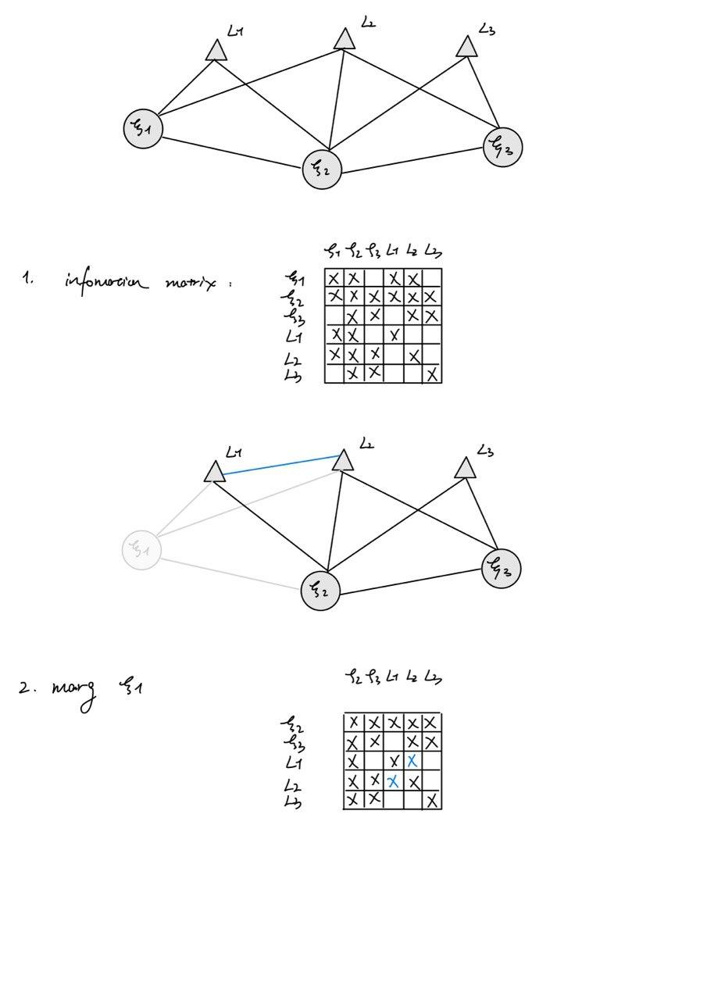
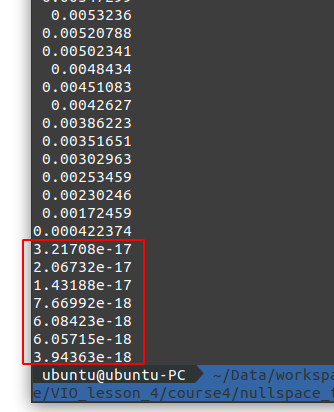

# Task1 

答案如图



# Task2

题目问的我认为有些小问题，应该是证明Hessian和协方差矩阵逆之间的关系

[pdf](VIO_lesson_4.pdf)


# Task3

### Result

发现最后7维是约等于0的



### Code

```c++
H.block(i * 6, i * 6, 6, 6) += jacobian_Ti.transpose() * jacobian_Ti;
H.block(poseNums * 6 + j * 3, poseNums * 6 + j * 3, 3, 3) += jacobian_Pj.transpose() * jacobian_Pj;
H.block(i * 6, poseNums * 6 + j * 3, 6, 3) = jacobian_Ti.transpose() * jacobian_Pj;
H.block(poseNums * 6 + j * 3, i * 6, 3, 6) = jacobian_Pj.transpose() * jacobian_Ti;
```

