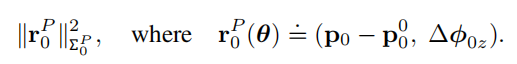
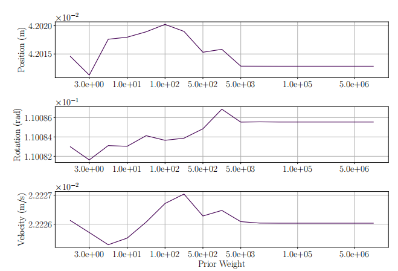

# Questions

why noalias()

```c++
                H.block(index_i, index_j, dim_i, dim_j).noalias() += hessian;
```

# Task 1

### Code

MakeHessian

```c++
                // TODO:: home work. 完成 H index 的填写.
                H.block(index_i, index_j, dim_i, dim_j).noalias() += hessian;
                if (j != i) {
                    // 对称的下三角
            // TODO:: home work. 完成 H index 的填写.
                    H.block(index_j, index_i, dim_j, dim_i).noalias() += hessian.transpose();
                }

```


SolveLinearSystem

注意，代码中的bpp定义为ppt中的-bp，有一个负号

```c++
        // TODO:: home work. 完成矩阵块取值，Hmm，Hpm，Hmp，bpp，bmm
        // pose first, measurement second; all = pose + second = reservesize + marg_size
        MatXX Hmm = Hessian_.block(reserve_size, reserve_size, marg_size, marg_size);
        MatXX Hpm = Hessian_.block(0, reserve_size, reserve_size, marg_size);
        MatXX Hmp = Hessian_.block(reserve_size, 0, marg_size, reserve_size);
        VecX bpp = b_.segment(0, reserve_size);
        VecX bmm = b_.segment(reserve_size, marg_size);


        // TODO:: home work. 完成舒尔补 Hpp, bpp 代码
        MatXX tempH = Hpm * Hmm_inv;
        H_pp_schur_ = Hessian_.block(0, 0, reserve_size, reserve_size) - tempH * Hmp;
        b_pp_schur_ = bpp - tempH * bmm;

        // TODO:: home work. step3: solve landmark
        VecX delta_x_ll(marg_size);
        delta_x_ll = Hmm_inv * (bmm - Hmp * delta_x_pp);
        delta_x_.tail(marg_size) = delta_x_ll;


```


TestMarginalze

注意矩阵中marg和rest的位置和ppt有所不一样

```c++
    H_marg.block(idx, 0, reserve_size - idx - dim, reserve_size) = temp_botRows;
    H_marg.block(reserve_size - dim, 0, dim, reserve_size) = temp_rows;

    Eigen::MatrixXd Arm = H_marg.block(0, reserve_size - dim, reserve_size - dim, dim);
    Eigen::MatrixXd Amr = H_marg.block(reserve_size - dim, 0, dim, reserve_size - dim);
    Eigen::MatrixXd Arr = H_marg.block(0, 0, reserve_size - dim, reserve_size - dim);

```


### Result


# Task 2 Comparison of different approaches for gauge freedom

一个general 的vio残差方程为


## Method 1: fixing unobservable states to given values 

### Idea： 固定第一个camera pose的position和yaw angle


将这两个参数固定等价为，让对应的残差方程的Jacobian列向量为0，即不再优化


## Method 2: setting a prior on unobservable states  

### Idea：对残差方程添加一个惩罚项



选择先验协方差的方法：


这个方法，当wp=0的时候，等价于free gauge 方法(Method 3)，当wp为无穷的时候，为gauge fixation方法(Method 1)


论文比较了不同wp对**精确度**和**计算时间**的影响，结果如下图所示：


### Accuracy:



如图所示，无论wp取多少，error都非常接近，同时随着wp上升，error趋近于固定值


### Computational Cost:


对于计算时间而言，类似于accuracy，在wp增大时候，都维持在了一个固定值。而计算时间随着wp的增加，先升高后降低


### 结论

由于wp对accuracy影响不大，我们主要从computational cost考虑。我们希望更大的wp来减小计算时间，但是极大的wp有可能导致优化不稳定。因此论文采用了10^5作为wp


### Method 3: letting the states evolve freely

Idea：不作处理，H矩阵保持奇异性。通过LM方法或者违逆来计算H的逆


# Task3 

### Code

TestMonoBA.cpp文件，添加了额外的edge

```c++
    // todo homework
    if (IF_ADD_PRIOR) {
        for (size_t i = 0; i < 2; ++i) {
            shared_ptr<EdgeSE3Prior> edge_aprior(new EdgeSE3Prior(cameras[i].twc, cameras[i].qwc));
            vector<shared_ptr<Vertex>> edge_vertex;
            edge_vertex.push_back(vertexCams_vec[i]);
            edge_aprior->SetVertex(edge_vertex);
            edge_aprior->SetInformation(edge_aprior->Information() * W_P);

            problem.AddEdge(edge_aprior);
        }
    }
    // todo end
```


### Result

添加第0和第1帧的a prior约束，对比不同w的结果

| wp         | Iters | chi        |
| ---------- | ----- | ---------- |
| no a prior | 3     | 1.09162e-4 |
| 0          | 3     | 1.09162e-4 |
| 1e-3       | 5     | 1.07290e-4 |
| 1e0        | 3     | 1.09615e-4 |
| 1e3        | 3     | 1.17293e-4 |
| 1e6        | 3     | 1.19186e-4 |
| 1e9        | 3     | 1.21314e-4 |

注意：相同代码多次运算得到的time cost差异很大，范围从(0.2ms ~ 0.6ms)波动，不具备参考价值。

其中迭代次数与论文基本符合，先增加后减少

但是残差chi持续增加
