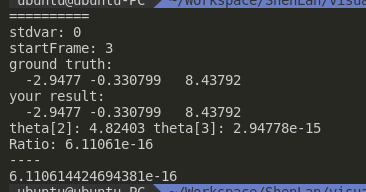
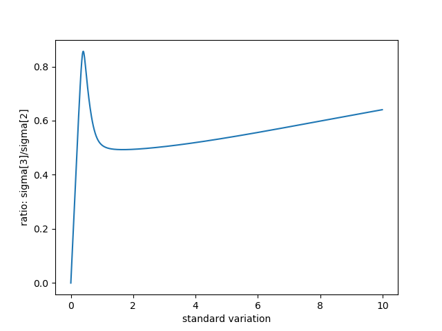
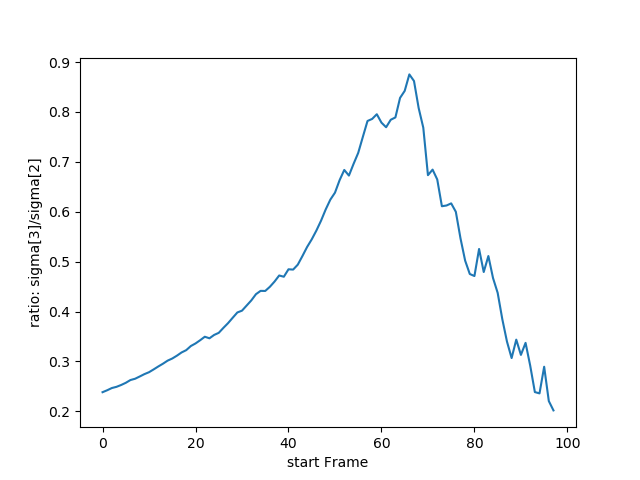

# Task1

## Question

证明三角化的公式推导

见[pdf](Task1.pdf)

# Task2

## Question

完成三角化代码

## Answer

### Code

```c++
    int num = end_frame_id - start_frame_id;
    Eigen::MatrixXd D(num * 2, 4);

    for (int i = 0; i < num; ++i) {
        double u = camera_pose[i + start_frame_id].uv[0];
        double v = camera_pose[i + start_frame_id].uv[1];

        Eigen::Matrix3d Rcw = camera_pose[i + start_frame_id].Rwc.transpose();
        Eigen::Vector3d tcw = -Rcw * camera_pose[i + start_frame_id].twc;

        Eigen::Vector4d P0, P1, P2;
        P0 << Rcw(0, 0), Rcw(0, 1), Rcw(0, 2), tcw(0);
        P1 << Rcw(1, 0), Rcw(1, 1), Rcw(1, 2), tcw(1);
        P2 << Rcw(2, 0), Rcw(2, 1), Rcw(2, 2), tcw(2);

        D.block(2 * i, 0, 1, 4) = u * P2.transpose() - P0.transpose();
        D.block(2 * i + 1, 0, 1, 4) = v * P2.transpose() - P1.transpose();
    }

    Eigen::JacobiSVD<Eigen::MatrixXd> svd(D, Eigen::ComputeFullU | Eigen::ComputeFullV);
    Eigen::Matrix4d V = svd.matrixV();
    Eigen::Vector4d v_last = V.col(3);
    P_est = v_last.hnormalized();

    Eigen::Vector4d SingularValues = svd.singularValues();
    double ratio = SingularValues[3] / SingularValues[2];
```

### Result



# Task3

## Question

对测量值添加噪声，绘制最新最小奇异值和第二小奇异值的比例变化曲线

## Answer

### Code

* 使用pybind11，进行更方便绘制
* 将pose扩大到100
* 对观测到的u和v添加高斯噪声，均值为0

c++:

```c++
	// todo::homework, task 2, add noise in measurement
    std::default_random_engine generator_2;
    std::normal_distribution<double> dist(0., stdvar);
    // todo end  
......
		// todo: homework, task 2, add noise in measurement
        double u = x / z;
        double v = y / z;
        if (stdvar != 0.) {
            u = u + dist(generator);
            v = v + dist(generator);
        }


        camera_pose[i].uv = Eigen::Vector2d(u, v);
        // todo end
```


```c++
PYBIND11_MODULE(triangulate, m) {
    m.doc() = "pybind 11 triangulate";
    m.def("run", &run, "run(double stdvar, int startFrame)", pybind11::arg("stdvar"), pybind11::arg("startFrame"));
}
```

python:

```python
def run_compare_by_noise():
    stdvar_list = np.arange(0, 10, 0.01)
    ratio_list = [tri.run(stdvar, DEFAULT_START_FRAME) for stdvar in stdvar_list]

    plt.ylabel("ratio: sigma[3]/sigma[2]")
    plt.xlabel("standard variation")
    plt.plot(stdvar_list, ratio_list)
    plt.show()
```

### Result



# Task4

## Question

调整观测图像帧数，绘制曲线

## Answer

* 我将总共pose控制为100帧
* 同时调整start frame 进行绘制

### Code

```python
def run_compare_by_start_frame():
    startFrame_list = [i for i in range(98)] # 一共100个pose，控制start从0到98
    print(startFrame_list)
    ratio_list = [tri.run(DEFAULT_STDVAR, startFrame) for startFrame in startFrame_list]
    
    plt.ylabel("ratio: sigma[3]/sigma[2]")
    plt.xlabel("start Frame")
    plt.plot(startFrame_list, ratio_list)
    plt.show()
```


### Result

