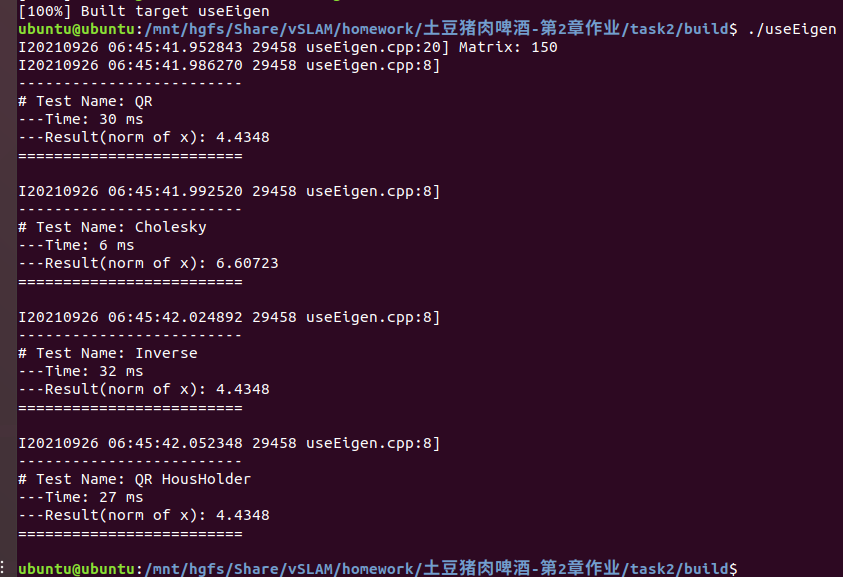
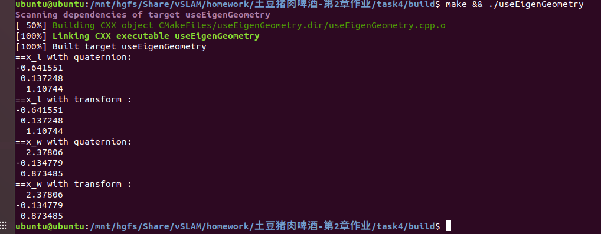
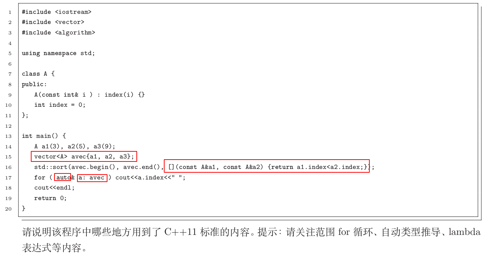

# 说明

* 任务2－7请查看对应pdf
* 编程任务请查看对应文件夹

## Task2

实现了

* QR(Householder
* Cholesky(lldt
* Invers
* QR（colPivHouseholder）

经过对比 cholesky速度最快，但是精度最低

## Task4

使用了两种方法分别计算答案

* Transform Matrix
* Quaternion

## Task8

出现c++11语法的有

* keyword `auto`
* easy traversal
* lamda function
* new initialization method

