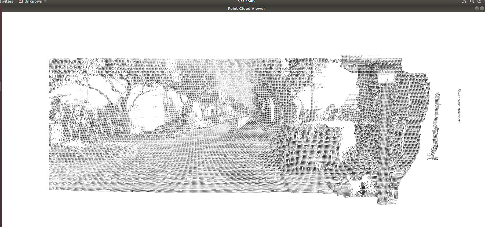
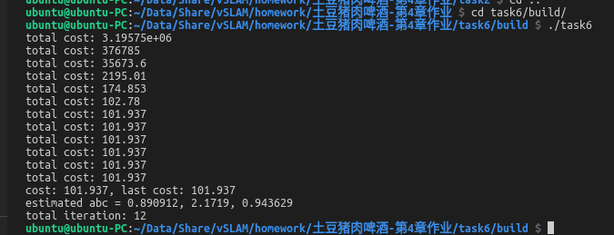

## Task 2

### 核心代码

```c++
// start your code here
double x = (u - cx) / fx;
double y = (v - cy) / fy;
double r = sqrt(x * x + y * y);
double x_distorted = x*(1 + k1*pow(r, 2) + k2*pow(r, 4)) + p2*(pow(r, 2) + 2*pow(x, 2)) + 2*p1*x*y;
double y_distorted = y*(1 + k1*pow(r, 2) + k2*pow(r, 4)) + p1*(pow(r, 2) + 2*pow(y, 2)) + 2*p2*x*y;

u_distorted = fx * x_distorted + cx;
v_distorted = fy * y_distorted + cy;

// end your code here
```

### 运行结果


## Task 3

### 简答题

请看对应[pdf](./Task3.pdf)

### 核心代码

```c++
// start your code here
double a = (u - cx) / fx, b = (v - cy) / fy;
double r = sqrt(a * a + b * b);
double theta = atan(r);

double theta_d = theta * (1 + k1*pow(theta, 2) + k2*pow(theta, 4) + k3*pow(theta, 6) + k4*pow(theta, 8));

double x_distorted = theta_d / r * a;
double y_distorted = theta_d / r * b;

u_distorted = fx * (x_distorted + alpha * y_distorted) + cx;
v_distorted = fy * y_distorted + cy;
// end your code here

```

### 运行结果


## Task 4

### 简答题

请看对应[pdf](./Task4.pdf)

### 核心代码

```c++
// start your code here (~6 lines)
// 根据双目模型计算 point 的位置
double x = (u - cx) / fx;
double y = (v - cy) / fy;
double z = fx * d / (disparity.at<uchar>(v, u));
point[0] = x * z;
point[1] = y * z;
point[2] = z;

pointcloud.push_back(point);
// end your code here
```

### 运行结果



## Task 5

### 简答题

请看对应[pdf](./Task5.pdf)

## Task 6

### 核心代码

```c++
// start your code here
double error = 0;   // 第i个数据点的计算误差
error = yi - exp(ae * xi * xi + be * xi + ce); // 填写计算error的表达式
J[0] = (error - yi) * xi * xi;  // de/da
J[1] = (error - yi) * xi;  // de/db
J[2] = (error - yi);  // de/dc

H += J * J.transpose(); // GN近似的H
b += -error * J;
// end your code here
//
//---
//
// start your code here
Vector3d dx;
dx = H.ldlt().solve(b);
// end your code here

```

### 运行结果



## Task 7

### 简答题

请看对应[pdf](./Task7.pdf)