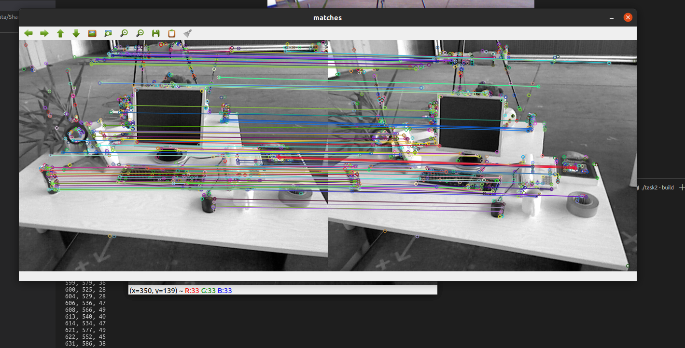
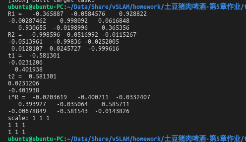
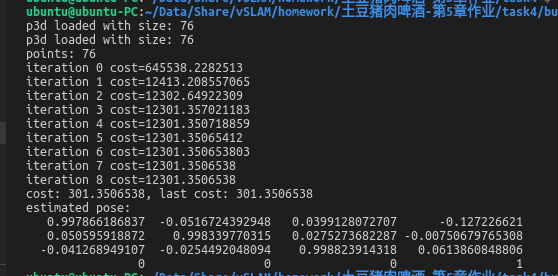
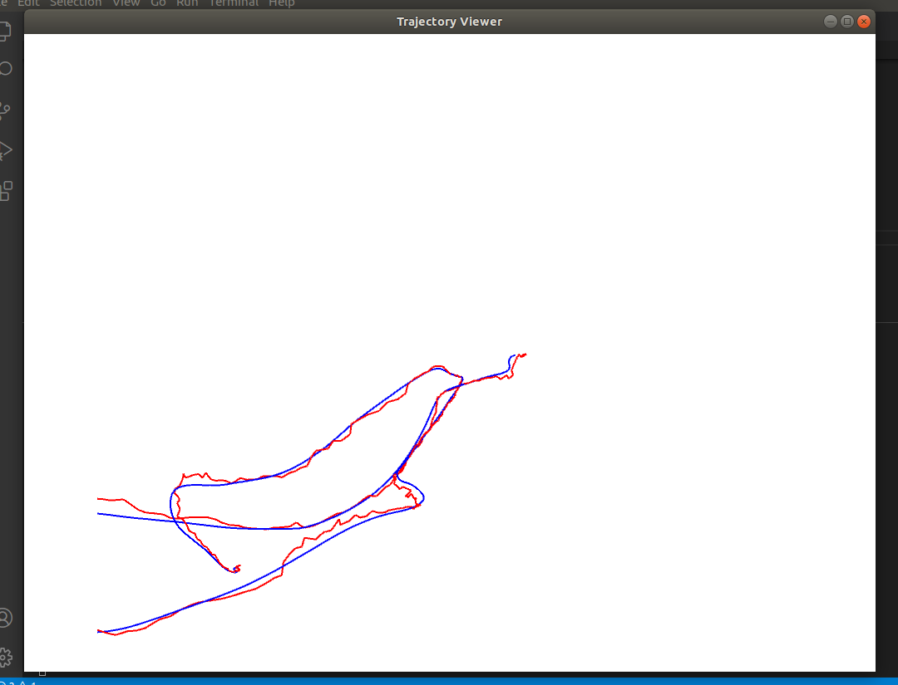

# Task 2

详细代码请参考文件夹[task2](./task2)

## 2.1 orb 提取

### 核心代码

```c++
void computeAngle(const cv::Mat &image, vector<cv::KeyPoint> &keypoints) {
  int half_patch_size = 8;


  for (auto &kp : keypoints) {
    // START YOUR CODE HERE (~7 lines)
    int x = kp.pt.x;
    int y = kp.pt.y;

    double m01 = 0.0;
    double m10 = 0.0;

    if (x - half_patch_size < 0 or x + half_patch_size > image.cols or
        y - half_patch_size < 0 or y + half_patch_size > image.rows) 
        continue;

    for (int i = -half_patch_size; i < half_patch_size; ++i) {
      for (int j = -half_patch_size; j < half_patch_size; ++j) {
        m01 += j * image.at<uchar>(y + j, x + i);
        m10 += i * image.at<uchar>(y + j, x + i);
      }
    }
    kp.angle = atan2(m01, m10) / pi * 180;
    // END YOUR CODE HERE
  }
  return;
}
```

## 2.2 orb 描述

### 核心代码

```c++
// compute the descriptor
void computeORBDesc(const cv::Mat &image, vector<cv::KeyPoint> &keypoints,
                    vector<DescType> &desc) {
  for (auto &kp : keypoints) {
    DescType d(256, false);
    for (int i = 0; i < 256; ++i) {
      // START YOUR CODE HERE (~7 lines)
      int u_p = ORB_pattern[4*i];
      int v_p = ORB_pattern[4*i + 1];
      int u_q = ORB_pattern[4*i + 2];
      int v_q = ORB_pattern[4*i + 3];

      double angle = kp.angle * pi / 180;
      double cos_ = cos(angle);
      double sin_ = sin(angle);

      float u_p_ = cos_ * u_p - sin_ * v_p;
      float v_p_ = sin_ * u_p + cos_ * v_p;
      float u_q_ = cos_ * u_q - sin_ * v_q;
      float v_q_ = sin_ * u_q + cos_ * v_q;

      u_p_ = kp.pt.x + u_p_;
      v_p_ = kp.pt.y + v_p_;
      u_q_ = kp.pt.x + u_q_;
      v_q_ = kp.pt.y + v_q_;

      if(u_p_ < 0 or u_p_ > image.cols or v_p_ < 0 or v_p_ > image.rows or
         u_q_ < 0 or u_q_ > image.cols or v_q_ < 0 or v_q_ > image.rows) {
           d.clear();
           break;
         }
      double I_p = image.at<uchar>(v_p_, u_p_);
      double I_q = image.at<uchar>(v_q_, u_q_);

      
      d[i] = (I_p < I_q);
      
      // END YOUR CODE HERE
    }
    desc.push_back(d);
  }

  int bad = 0;
  for (auto &d : desc) {
    if (d.empty())
      bad++;
  }
  cout << "bad/total: " << bad << "/" << desc.size() << endl;
  return;
}
```

## 2.3 暴力匹配

### 核心代码

```c++
void bfMatch(const vector<DescType> &desc1, const vector<DescType> &desc2,
             vector<cv::DMatch> &matches) {
  int d_max = 50;

  // START YOUR CODE HERE (~12 lines)
  for (int i=0; i<desc1.size(); ++i) {
    if (desc1[i].empty()) 
      continue;

    int d_min = 256;
    int pair_index = -1;

    for (int j = 0; j < desc2.size(); ++j) {
      if (desc2[j].empty()) 
        continue;

      int distance = 0;

      for (int k=0; k<256; ++k) {
        // if(desc1[i][k] != desc2[j][k]) {
        //   ++distance;
        // }
        distance += desc1[i][k]^desc2[j][k];
      }

      if (distance <= d_min) {
        d_min = distance;
        pair_index = j;
      }
    }

    if (d_min <= d_max) {
      cv::DMatch match = cv::DMatch(i, pair_index, d_min);
      matches.push_back(match);
    }

  }
  // find matches between desc1 and desc2.

  // END YOUR CODE HERE

  for (auto &m : matches) {
    cout << m.queryIdx << ", " << m.trainIdx << ", " << m.distance << endl;
  }
  return;

}
```

## 2.4 多线程

* 由于环境配置原因，没有完成此任务。

* 有参考同学发的csdn上的指导，但是虽然tbb问题解决，又出现了lamda代码正常却无法编译的问题（不用tbb lamda代码可以正常编译）。

* 经过查找，发现gcc9虽然可以设置c++17，但表示的内在含义是：“使用已经完善的c++17功能”，gcc9并不完全支持c++17的全部功能。

* 有一篇帖子说目前msvc或者intel的编译器icc支持tbb这个功能，其他编译器尚不支持，遂放弃此任务。

## 简答题

1. 因为orb采用的比较p, q两点的灰度值，储存的是bool值，所以是二进制特征
2. 阈值越小越严苛，最终match对数越少
3. 暴力匹配速度很快。可以用kdtree来搜索最邻近
4. 多线程未完成

## 运行结果



# Task 3 

详细代码请参考文件夹[task3](./task3)

### 核心代码

```c++
Matrix3d t_wedge1;
Matrix3d t_wedge2;

Matrix3d R1;
Matrix3d R2;

Matrix3d R_z_pos = AngleAxisd(M_PI_2, Vector3d{0, 0, 1}).toRotationMatrix();
Matrix3d R_z_neg = AngleAxisd(-M_PI_2, Vector3d{0, 0, 1}).toRotationMatrix();

t_wedge1 = U * R_z_pos * sigma_matrix * U.transpose();
t_wedge2 = U * R_z_neg * sigma_matrix * U.transpose();
R1 = U * R_z_pos.transpose() * V.transpose();
R2 = U * R_z_neg.transpose() * V.transpose();
```

### 运行结果



# Task 4

详细代码请参考文件夹[task4](./task4)

### 核心代码

```c++
            J(0, 0) = fx/z;
            J(0, 1) = 0;
            J(0, 2) = -fx*x/(z*z);

            J(0, 3) = -fx*x*y/(z*z);
            J(0, 4) = fx+fx*x*x/(z*z);
            J(0, 5) = -fx*y/z;

            J(1, 0) = 0;
            J(1, 1) = fy/z;
            J(1, 2) = -fy*y/(z*z);

            J(1, 3) = -fy-fy*y*y/(z*z);
            J(1, 4) = fy*x*y/(z*z);
            J(1, 5) = fy*x/z;
            J = -J;

```

### 运行结果



# Task5 ICP

详细代码请参考文件夹[task5](./task5)

### 运行结果


